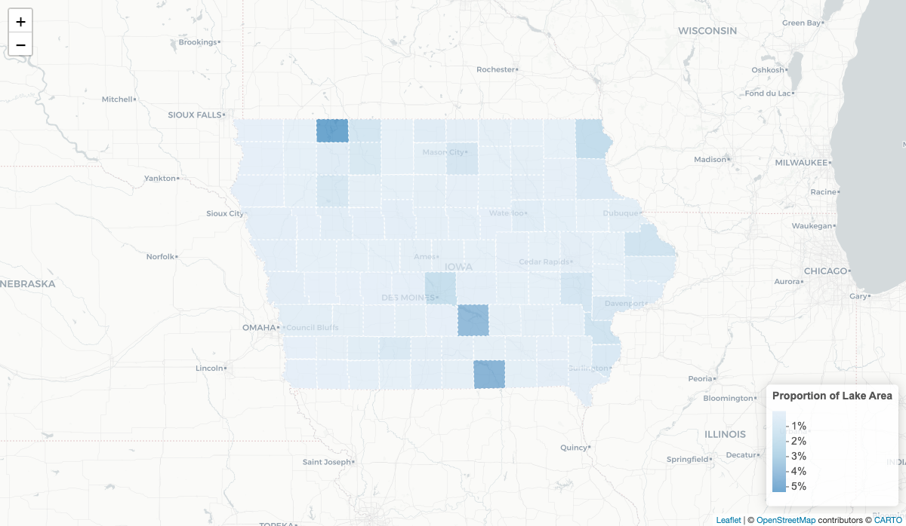
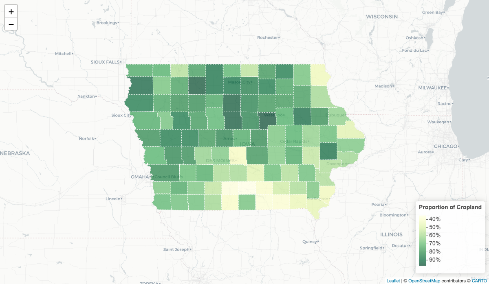
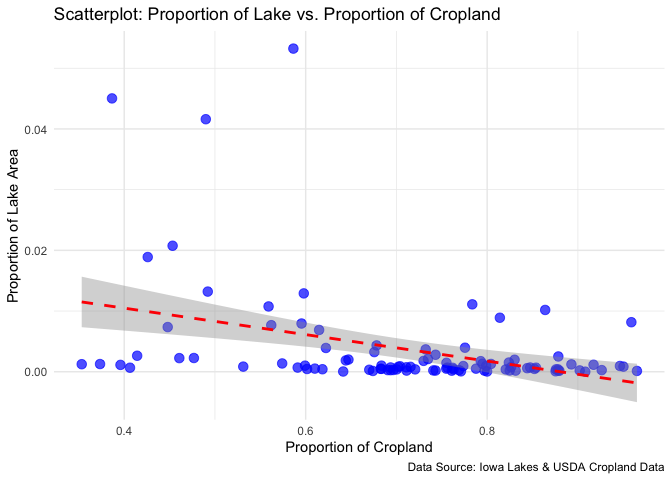

Distribution of Lakes Across Iowa Counties
================
Huy Nguyen, Nhat Le
2024-12-14

``` r
knitr::opts_chunk$set(echo = TRUE, warning=FALSE, message=FALSE)
```

# Introduction

Iowa is famous for its extensive agricultural landscape and its numerous
lakes. Understanding the spatial distribution of these water bodies and
their relationship to agricultural land use can inform environmental
policy, resource management, and sustainable farming practices. This
project aims to explore how the density of lakes correlates with
agricultural areas across Iowa’s 99 counties. The analysis begins with a
description of the data, followed by in-depth exploratory work, multiple
analytical approaches, careful skepticism regarding findings, and
ultimately, the presentation of clear conclusions and suggestions for
future work.

# Data

We use three key datasets:

    1.  Lake Data (913 Lakes): This dataset, sourced from data.iowa.gov, provides geographic coordinates and county affiliations of lakes in Iowa. 

    2.  County Boundary Data: Retrieved using the tigris R package, this spatial dataset includes geometries and areas for Iowa’s 99 counties.

    3.  Agricultural Land Data: Obtained from the USDA, this dataset provides insights into agricultural land areas, measured in acres, by county.

Each dataset has been cleaned and transformed to align county names,
calculate county and lake areas, and merge agricultural data for
subsequent correlation analyses.

``` r
library(tigris)
library(dplyr)
library(sf)
library(ggplot2)
library(leaflet)
library(stringr)
library(tidyr)
library(knitr)
```

``` r
# data loading
counties <- counties(state = "IA", cb = TRUE, class = "sf") 
```

    ##   |                                                                              |                                                                      |   0%  |                                                                              |                                                                      |   1%  |                                                                              |=                                                                     |   1%  |                                                                              |=                                                                     |   2%  |                                                                              |==                                                                    |   2%  |                                                                              |==                                                                    |   3%  |                                                                              |==                                                                    |   4%  |                                                                              |===                                                                   |   4%  |                                                                              |===                                                                   |   5%  |                                                                              |====                                                                  |   5%  |                                                                              |====                                                                  |   6%  |                                                                              |=====                                                                 |   7%  |                                                                              |=====                                                                 |   8%  |                                                                              |======                                                                |   8%  |                                                                              |======                                                                |   9%  |                                                                              |=======                                                               |   9%  |                                                                              |=======                                                               |  10%  |                                                                              |=======                                                               |  11%  |                                                                              |========                                                              |  11%  |                                                                              |========                                                              |  12%  |                                                                              |=========                                                             |  12%  |                                                                              |=========                                                             |  13%  |                                                                              |==========                                                            |  14%  |                                                                              |==========                                                            |  15%  |                                                                              |============                                                          |  18%  |                                                                              |=============                                                         |  18%  |                                                                              |=============                                                         |  19%  |                                                                              |==============                                                        |  19%  |                                                                              |==============                                                        |  20%  |                                                                              |===============                                                       |  21%  |                                                                              |===============                                                       |  22%  |                                                                              |================                                                      |  22%  |                                                                              |================                                                      |  23%  |                                                                              |=================                                                     |  24%  |                                                                              |=================                                                     |  25%  |                                                                              |==================                                                    |  25%  |                                                                              |==================                                                    |  26%  |                                                                              |===================                                                   |  26%  |                                                                              |===================                                                   |  27%  |                                                                              |===================                                                   |  28%  |                                                                              |====================                                                  |  28%  |                                                                              |====================                                                  |  29%  |                                                                              |=====================                                                 |  29%  |                                                                              |=====================                                                 |  30%  |                                                                              |======================                                                |  31%  |                                                                              |======================                                                |  32%  |                                                                              |=======================                                               |  33%  |                                                                              |=======================                                               |  34%  |                                                                              |========================                                              |  34%  |                                                                              |========================                                              |  35%  |                                                                              |=========================                                             |  35%  |                                                                              |==========================                                            |  37%  |                                                                              |==========================                                            |  38%  |                                                                              |===========================                                           |  38%  |                                                                              |===========================                                           |  39%  |                                                                              |============================                                          |  40%  |                                                                              |===============================                                       |  44%  |                                                                              |===============================                                       |  45%  |                                                                              |================================                                      |  46%  |                                                                              |=================================                                     |  47%  |                                                                              |===================================                                   |  51%  |                                                                              |=============================================                         |  65%  |                                                                              |====================================================                  |  74%  |                                                                              |====================================================                  |  75%  |                                                                              |=====================================================                 |  75%  |                                                                              |=====================================================                 |  76%  |                                                                              |======================================================                |  77%  |                                                                              |======================================================                |  78%  |                                                                              |=======================================================               |  78%  |                                                                              |=======================================================               |  79%  |                                                                              |========================================================              |  80%  |                                                                              |=========================================================             |  81%  |                                                                              |=========================================================             |  82%  |                                                                              |==========================================================            |  82%  |                                                                              |==========================================================            |  83%  |                                                                              |===========================================================           |  84%  |                                                                              |===========================================================           |  85%  |                                                                              |============================================================          |  85%  |                                                                              |============================================================          |  86%  |                                                                              |=============================================================         |  87%  |                                                                              |==============================================================        |  88%  |                                                                              |==============================================================        |  89%  |                                                                              |===============================================================       |  89%  |                                                                              |======================================================================| 100%

``` r
lakes <- read.csv('https://data.iowa.gov/resource/2mmi-txzx.csv')
agland_acres <- read.csv('./data/Cropland_Acres.csv')
```

# Main Analysis - Curiosity

To understand the intricate interplay between agriculture and natural
water distribution, multiple approaches were tried. These included:

1.  Spatial Mapping: Creating choropleth maps to visualize lake density
    and proportion of agricultural land per county.

2.  Area Calculations: Computing county areas and normalizing lake and
    cropland data by total county area.

3.  Statistical Correlations: Running correlation tests (Pearson’s r) to
    explore the relationship between lake area proportions and cropland
    proportions.

4.  Iterative Refinement: Testing multiple spatial joins, experimenting
    with different geographic projections, and recalculating area
    metrics to ensure consistency and accuracy.

In the pursuit of uncovering meaningful patterns, many trial mappings
and exploratory plots were generated. Only the most illustrative and
informative outputs are included here, representing the culmination of
extensive preliminary work.

# Main Analysis - Scepticism

We maintained a critical lens throughout:

1.  Verifying Unintuitive Patterns: If a county with known lakes showed
    low lake area, we rechecked geometries, projections, and data joins.

2.  Comparing Projections: Ensured CRS was appropriate and consistent
    for area calculations.

3.  Double-Checking Data Merges: Confirmed that county names in all
    datasets matched properly to avoid misalignments.

This skepticism increased the reliability and credibility of the final
findings.

# Main Analysis - Organization

The analysis is structured to guide the reader clearly:

1.  Data Acquisition & Cleaning: Load and harmonize datasets.

2.  Spatial & Statistical Analysis: Map spatial distributions, compute
    proportions, test correlations.

3.  Refinement & Presentation: Present the most pertinent
    visualizations, results, and narratives.

4.  Conclusions & Future Directions: Summarize key takeaways and propose
    next steps.

Logical progression, clear headings, and careful selection of included
results ensure a coherent narrative.

# Incorporating Code Analyses - Visualization

Below, we include the code segments from the initial R Markdown, adapted
for this README. This code shows how we processed counties, lakes, and
agricultural data, calculated areas, and prepared the data for
visualization and correlation testing.

## County Areas

``` r
counties_area <- counties %>%
  mutate(county_area_sqm = st_area(geometry)) %>%
  mutate(county_area_acres = as.numeric(county_area_sqm) * 0.000247105) %>%
  select(NAME, county_area_acres) %>%
  st_set_geometry(NULL)
```

## Lake Data Preparation

``` r
lakes_sf <- st_as_sf(lakes, wkt = "the_geom", crs = 4326)
lakes_sf <- st_make_valid(lakes_sf)

lakes_sf <- lakes_sf %>%
  mutate(lake_area_sqm = st_area(the_geom)) %>%
  mutate(lake_area_acres = as.numeric(lake_area_sqm) * 0.000247105) 

lakes_summary <- lakes_sf %>%
  group_by(county) %>%
  summarize(total_lake_area_acres = sum(lake_area_acres, na.rm = TRUE)) %>%
  ungroup() %>%
  full_join(counties_area, by = c("county" = "NAME")) %>%
  mutate(prop_lake = total_lake_area_acres / county_area_acres) %>%
  st_set_geometry(NULL)
```

## Agricultural Data Preparation

``` r
agland_acres$County <- str_to_title(str_to_lower(agland_acres$County))

ag_percent <- agland_acres %>%
  select(County, Value) %>%
  arrange(County)

# Fix county name mismatch
ag_percent$County[71] <- "O'Brien"

ag_percent$Value <- as.numeric(gsub(",", "", ag_percent$Value))

ag_percent <- ag_percent %>%
  full_join(counties_area, by = c("County" = "NAME")) %>%
  mutate(prop_crop = Value / county_area_acres) %>%
  rename(crop_area_acres = Value) %>%
  select(County, crop_area_acres, county_area_acres, prop_crop)
```

## Merging Datasets

``` r
analysis_data <- lakes_summary %>%
  full_join(ag_percent, by = c("county" = "County"))

counties_data <- counties %>%
  left_join(analysis_data, by = c("NAME" = "county"))
```

## Correlation Test

``` r
analysis_data_clean <- analysis_data %>%
  filter(!is.na(prop_lake) & !is.na(prop_crop))

correlation_result <- cor.test(
  analysis_data_clean$prop_crop,
  analysis_data_clean$prop_lake,
  method = "pearson"
)

# Format the results for readability
cat("----- Correlation Results -----\n")
```

    ## ----- Correlation Results -----

``` r
cat("Test: Pearson's Product-Moment Correlation\n")
```

    ## Test: Pearson's Product-Moment Correlation

``` r
cat("Correlation Coefficient (r):", round(correlation_result$estimate, 3), "\n")
```

    ## Correlation Coefficient (r): -0.378

``` r
cat("p-value:", format(correlation_result$p.value, scientific = TRUE, digits = 3), "\n")
```

    ## p-value: 1.14e-04

``` r
cat("95% Confidence Interval: [", 
    round(correlation_result$conf.int[1], 3), ", ", 
    round(correlation_result$conf.int[2], 3), "]\n")
```

    ## 95% Confidence Interval: [ -0.536 ,  -0.195 ]

``` r
cat("--------------------------------\n")
```

    ## --------------------------------

## Visualization

### Lake Distribution

<!-- -->

### Cropland Distribution Map

<!-- -->

### Scatterplot Between Lake Distribution - Agricultural Land

<!-- -->

### Table

``` r
analysis_summary <- analysis_data_clean %>%
  arrange(desc(prop_lake)) %>%
  head(10) %>%
  mutate(
    lake_percent = scales::percent(prop_lake, accuracy = 0.1),
    crop_percent = scales::percent(prop_crop, accuracy = 0.1)
  ) %>%
  select(County = county, `Lake Area %` = lake_percent, `Cropland %` = crop_percent)

kable(analysis_summary, caption = "Top 10 Counties by Lake Proportion") 
```

| County      | Lake Area % | Cropland % |
|:------------|:------------|:-----------|
| Dickinson   | 5.3%        | 58.6%      |
| Appanoose   | 4.5%        | 38.7%      |
| Marion      | 4.2%        | 49.0%      |
| Allamakee   | 2.1%        | 45.3%      |
| Polk        | 1.9%        | 42.6%      |
| Jackson     | 1.3%        | 49.2%      |
| Louisa      | 1.3%        | 59.8%      |
| Emmet       | 1.1%        | 78.4%      |
| Johnson     | 1.1%        | 55.9%      |
| Cerro Gordo | 1.0%        | 86.4%      |

Top 10 Counties by Lake Proportion

# Conclusion

Our analysis suggests no strong linear correlation between the
proportion of lake areas and cropland areas in Iowa counties. Some
counties with extensive agricultural lands do not boast notable lake
coverage, indicating that lake distribution can influence cropland
distribution, but not too significant.

Future studies might delve into historical land use changes, soil
composition, climate influences, or environmental policies. These
additional variables could provide deeper insights into how agricultural
practices and natural water bodies interact over time.
